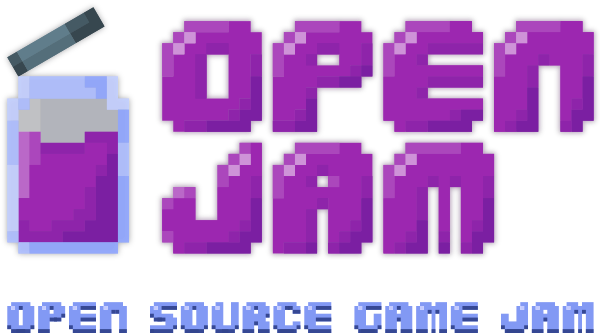

+++
title = "Open Jam brand"
date = "2019-09-27"
author = "@mwcz"
tags = ["open-jam", "brand", "logos"]
description = ""
showFullContent = false
+++

Here are the Open Jam brand images.  Feel free to use it these images in games submitted to Open Jam (great for splash screens!), and when promoting Open Jam on social media.

 Open Jam brand images by <a xmlns:cc="http://creativecommons.org/ns#" href="http://openjam.io/" property="cc:attributionName" rel="cc:attributionURL">Open Jam</a> is licensed under a <a rel="license" href="http://creativecommons.org/licenses/by-sa/4.0/">Creative Commons Attribution-ShareAlike 4.0 International License</a>. Based on a work at <a xmlns:dct="http://purl.org/dc/terms/" href="http://openjam.io/brand" rel="dct:source">http://openjam.io/brand</a>.

| Image            | No BG                                             | White BG                                                | Black BG                                                |
| ---              | ---                                               | ---                                                     | ---                                                     |
| Open Jam Jar PNG |  |  |  |
| Open Jam Jar SVG |  |  |  |
| openjam.io PNG |  |  |  | 
| openjam.io SVG |  |  |  |
| Logo with tagline PNG |  |  |  |
| Logo with tagline SVG |  |  |  |

